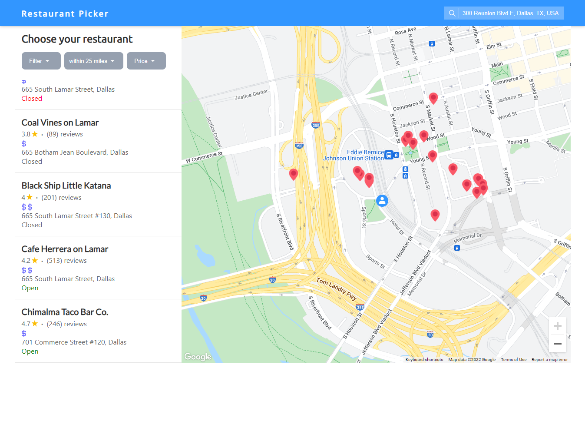

# Restaurant Picker

> ReactJS app that displays nearby restaurants using navigator in the browser and Google Maps APIs. Users can input their address to get a new list of restaurants. List of restaurants can be filtered and sorted by distance, user ratings, price, etc. 

### Packages
[react-google-autocomplete](https://www.npmjs.com/package/react-google-autocomplete)
[google-map-react](https://www.npmjs.com/package/google-map-react)