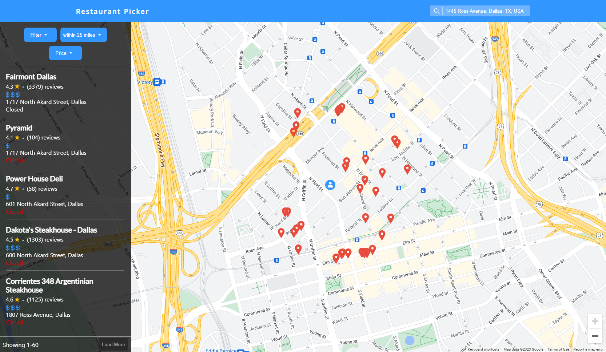

# Restaurant Picker
Application built using React, Firebase and Express that displays nearby restaurants using navigator in the browser and Google Maps APIs. Users can input their address to get a new list of restaurants. Restaurants can be filtered and sorted by distance, user ratings, price, etc. After a user has selected a series of restaurants a random one can be picked from the selection.

## Motivation
Wanted to make a simple, fun application for when someone might struggle deciding where to eat. Inadvertently ended up making something that helped me find good local restaurants in my area. From a learning perspective I built this project to help better understand google cloud services and eventually wanted to learn serverless with Firebase.

## Todo
* Keep user's previous searches in storage for easier access
* Search for restaurant locations based on map marker
* Incorporate react-router into project
* Use framer-motion for loading component on api fetch 
* Improve UI look and design
* Adjust layout for mobile views

## Technologies Used
* ReactJS
* Express
* Firebase
* NodeJS
* Axios
* [react-google-autocomplete](https://www.npmjs.com/package/react-google-autocomplete)
* [google-map-react](https://www.npmjs.com/package/google-map-react)